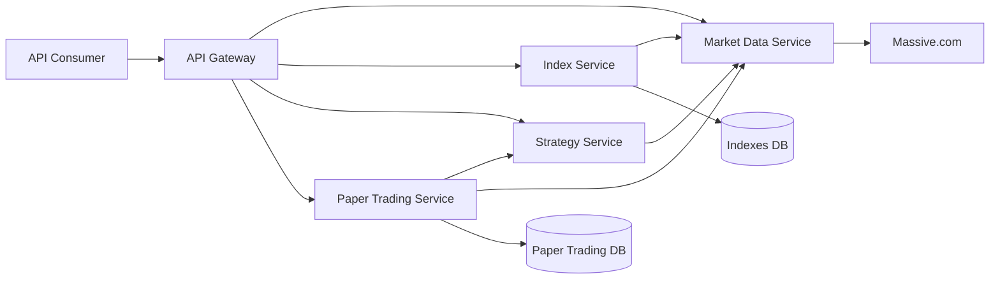
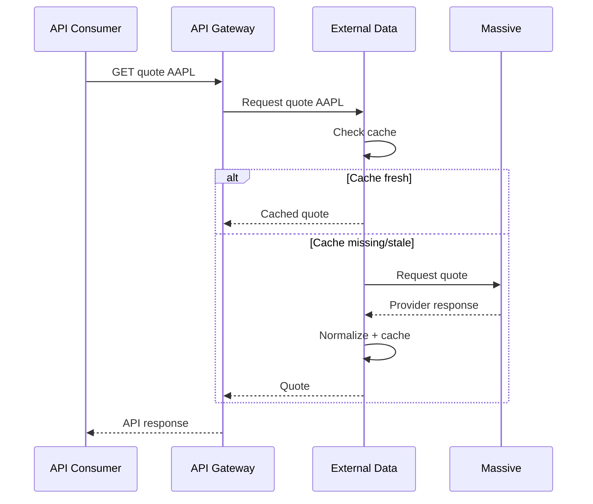

# System Architecture

**Author:** Dylan Liesenfelt

**Date:** August 21, 2026

---

## 1. System Overview

The system is a service-oriented backend composed of five primary services:

- API Gateway
- External Data Service
- Index Service
- Strategy Service
- Paper Trading Service

The API Gateway is the sole public-facing service. Internal services communicate
through explicitly defined APIs. Services own their respective business logic
and persistent data.

The External Data Service provides normalized financial market data to other
internal services and abstracts third-party providers such as Massive.com.

The system uses synchronous HTTP communication for request-driven operations
and service-local scheduled jobs for recurring operations such as paper-trading
strategy execution and index maintenance.

## 2. Service Communication

Initial service-to-service communication will use synchronous HTTP REST APIs.

All service-to-service requests shall:

- Use explicit timeouts
- Propagate correlation IDs
- Return defined error responses
- Use versioned API contracts where appropriate

Recurring work will be scheduled internally by the service responsible for
the operation.

No central scheduler service will be used.

### Request Examples

#### Get Ticker Qoute

## 3. Data Ownership

Each service owns the data associated with its domain.

- Index Service owns custom index definitions, constituents, and historical index values.
- Paper Trading Service owns accounts, positions, trades, and portfolio history.
- Services shall not directly modify data owned by another service.
- Cross-service data access shall occur through the owning service's API.

Detailed schemas and data models are defined in each service's own `*_DESIGN.md`
(`GATEWAY_DESIGN.md`, `MARKET_DATA_DESIGN.md`, `INDEXES_DESIGN.md`,
`STRATEGY_DESIGN.md`, `PAPER_TRADING_DESIGN.md`).

## 4. Service-Internal Architecture

Every service follows the same four internal layers. This was chosen to
support test-driven development and adherence to SOLID principles: each
layer depends only on the layer(s) inside it, never the reverse, which is
what makes each layer independently testable.

- **api**: 

Presentation layer. This is where the API consumer interacts with the service: parses and validates incoming requests, calls the service layer (or, for the Gateway only, a client directly), returns responses. No business logic lives here.

- **service**: 

Business/application logic. Orchestrates model objects and the data layer to fulfill a use case. Depends on data/ only through its abstract interfaces, never a concrete implementation (Dependency Inversion). This is what makes the service layer unit testable without a real database or network call. 

- **data**:

Where a service gets its data from, and validates it. This covers everything that reaches outside the service's own process: database access (via the Repository pattern, for the services that own one) and calls to other internal services or external providers (via clients/providers). Pydantic schemas that validate what comes back from a database or another service live here too, validating fetched data is this layer's job (as opposed to api/, which validates what the user sent in). Each repository, client, or provider exposes an interface the service layer depends on, so a fake implementation can stand in during tests.

Only Index Service and Paper Trading Service have a database inside their data/ layer. Every service still has a data/ layer of some kind if it talks to anything external, the Market Data Service's data/, for example, holds its cache and its Massive.com/Yahoo provider adapters, with no database involved at all.

- **models**:

Core objects representing the business concepts (Index, Account, Trade, Strategy, Quote, etc.). Plain classes with no knowledge of HTTP, databases, or other services. Fully unit testable with no mocking required.
