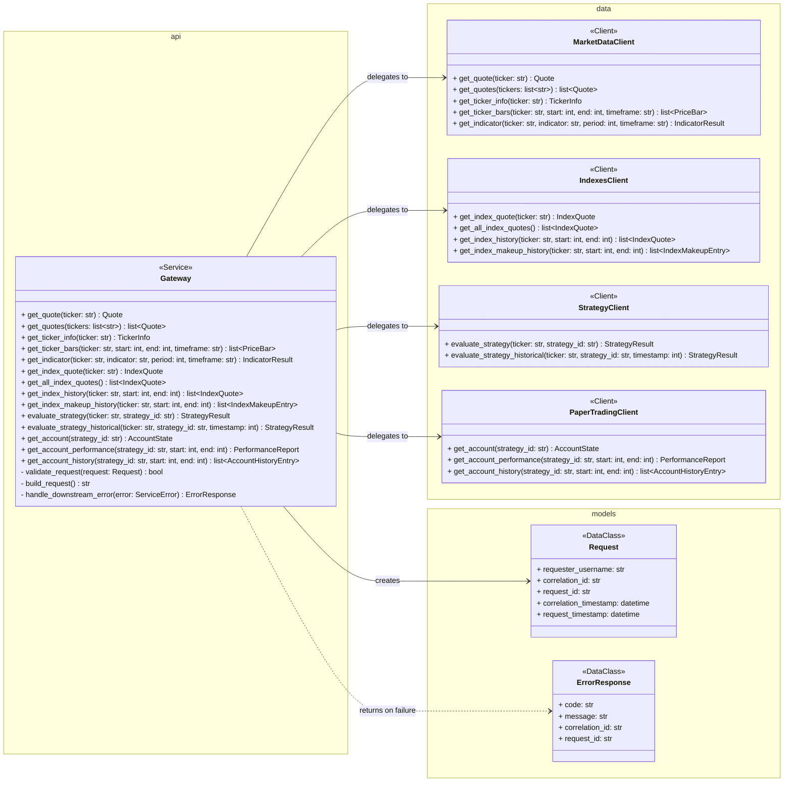
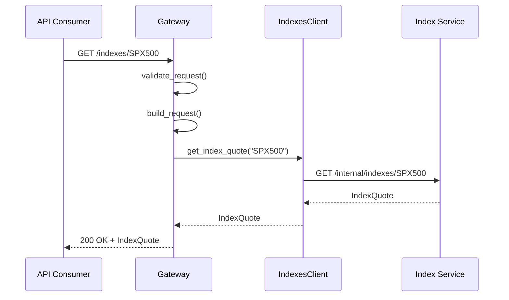
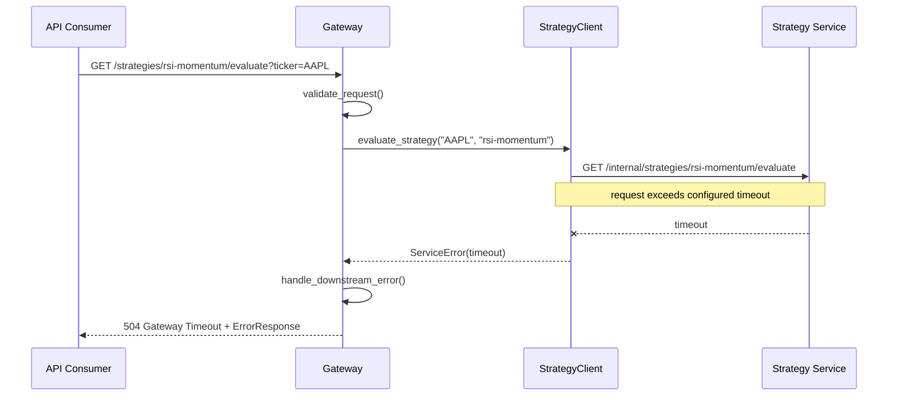

# API Gateway Service Design

**Author:** Dylan Liesenfelt

**Date:** August 21, 2026

---

## 1. Purpose / Scope

The API Gateway is the sole public-facing service in the system. It receives all external requests, validates them, routes them to the appropriate internal service, and returns a normalized response.

The Gateway does **not** contain financial calculation or trading-strategy business logic. It is a routing layer only.

Responsibilities:

- Receiving external API requests
- Request validation
- Authentication where required
- Routing requests to internal services
- Returning normalized API responses
- Propagating request correlation identifiers

## 2. Class Diagram

## 3. Sequence Diagrams

### 3.1 Single-Service Passthrough: Get Index Quote

### 3.2 Downstream Failure Handling

## 4. API / Endpoint Definitions (v1)

| Method | Endpoint | Description |
| --- | --- | --- |
| GET | /quotes/{ticker} | Latest quote for one ticker |
| GET | /quotes?tickers={tickers} | Latest quotes for multiple tickers |
| GET | /tickers/{ticker}/info | Company info for a ticker |
| GET | /tickers/{ticker}/bars?start=&end=&timeframe= | Historical OHLCV bars |
| GET | /tickers/{ticker}/indicators/{indicator}?period=&timeframe= | Calculated indicator values |
| GET | /indexes | List all index quotes |
| GET | /indexes/{ticker} | Latest quote for one index |
| GET | /indexes/{ticker}/history?start=&end= | Historical index values |
| GET | /indexes/{ticker}/makeup-history?start=&end= | Historical constituent makeup of an index |
| GET | /strategies/{strategy_id}/evaluate?ticker= | Evaluate strategy on demand |
| GET | /strategies/{strategy_id}/evaluate/historical?ticker=&timestamp= | Evaluate strategy at a point in time |
| GET | /accounts/{strategy_id} | Paper-trading account state |
| GET | /accounts/{strategy_id}/performance?start=&end= | Account/strategy performance |
| GET | /accounts/{strategy_id}/history?start=&end= | Historical account state (cash, positions, value over time) |

## 5. Data Model / Persistence

The Gateway does not own persistent data. Per ARCHITECTURE.md, the Gateway is stateless between requests, request context (`Request`) exists only for the lifetime of a single request and is never persisted.

## 6. Error Handling

- Requests are validated before routing (ticker symbols, date ranges, timeframes, strategy/index identifiers) per NFR-009. Invalid input returns `400` before any downstream call is made.
- Each downstream client call uses a bounded timeout (NFR-002). A timeout or downstream failure returns a standardized `ErrorResponse` with the originating correlation ID and request ID, not an unhandled exception.
- Failure of one downstream service does not block routing to unrelated services (NFR-003).
- Provider credentials/API keys are never present in any Gateway response (NFR-010), since the Gateway never talks to external providers directly.
- Every request is assigned a correlation ID and a request ID at ingress and propagated to all downstream calls (NFR-016).

## 7. Dependencies

- Market Data Service (via `MarketDataClient`)
- Index Service (via `IndexesClient`)
- Strategy Service (via `StrategyClient`)
- Paper Trading Service (via `PaperTradingClient`)

The Gateway has no direct dependency on external data providers, per ARCHITECTURE.md all external data access is confined to the Market Data Service.

## 8. Configuration

- Per-downstream-service request timeout (value TBD, e.g. 3-5s)
- Retry policy for downstream calls (bounded, per NFR-020, exact count TBD)
- Authentication: internal API keys provided via a `.env` list. Keys only exist at the Gateway, never in a downstream service, and are checked during request validation (NFR-011).
- Structured logging output format/destination (NFR-017)
