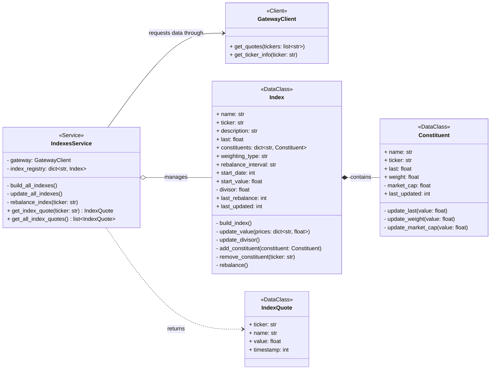

```mermaid
classDiagram
    direction LR
    
    class IndexesService {
        <<Service>>

        - gateway: GatewayClient
        - index_registry: dict~str, Index~

        - build_all_indexes()
        - update_all_indexes()
        - rebalance_index(ticker: str)

        + get_index_quote(ticker: str) IndexQuote
        + get_all_index_quotes() list~IndexQuote~
    }

    class GatewayClient {
        <<Client>>

        + get_quotes(tickers: list~str~)
        + get_ticker_info(ticker: str)
    }

    class Index {
        <<DataClass>>

        + name: str
        + ticker: str
        + description: str
        + last: float
        + constituents: dict~str, Constituent~
        + weighting_type: str
        + rebalance_interval: str
        + start_date: int
        + start_value: float
        - divisor: float
        + last_rebalance: int
        + last_updated: int

        - build_index()
        - update_value(prices: dict~str, float~)
        - update_divisor()
        - add_constituent(constituent: Constituent)
        - remove_constituent(ticker: str)
        - rebalance()
    }

    class Constituent {
        <<DataClass>>

        + name: str
        + ticker: str
        + last: float
        + weight: float
        - market_cap: float
        + last_updated: int

        - update_last(value: float)
        - update_weight(value: float)
        - update_market_cap(value: float)
    }

    class IndexQuote {
        <<DataClass>>

        + ticker: str
        + name: str
        + value: float
        + timestamp: int
    }

    IndexesService --> GatewayClient : requests data through
    IndexesService o-- Index : manages
    Index *-- Constituent : contains
    IndexesService ..> IndexQuote : returns
    
```
