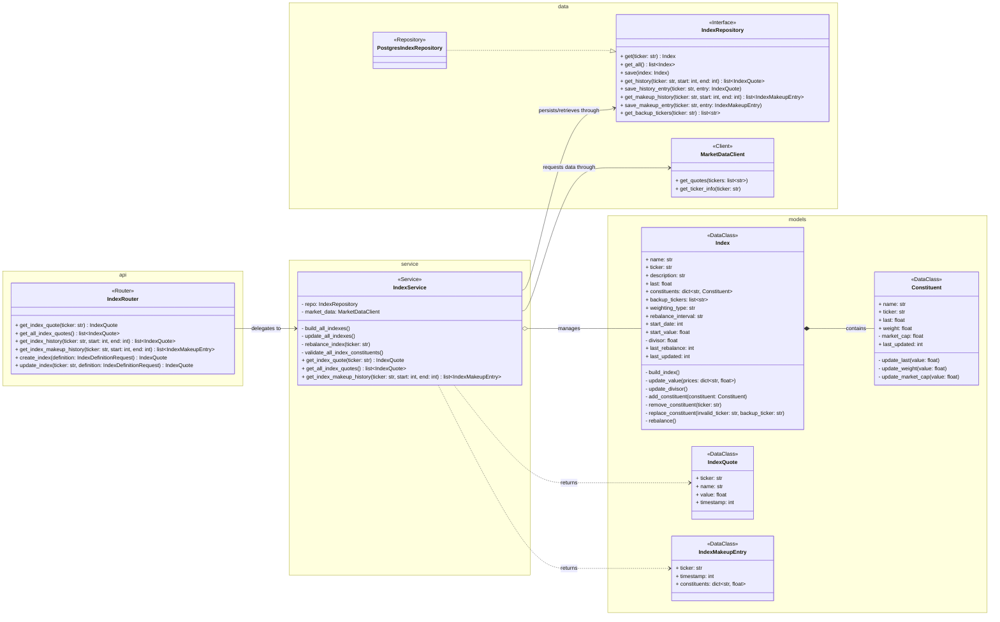
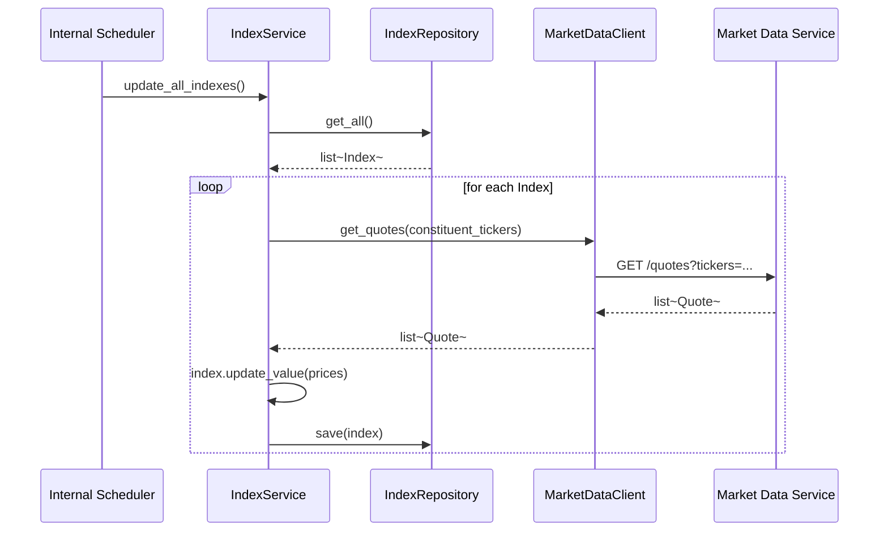
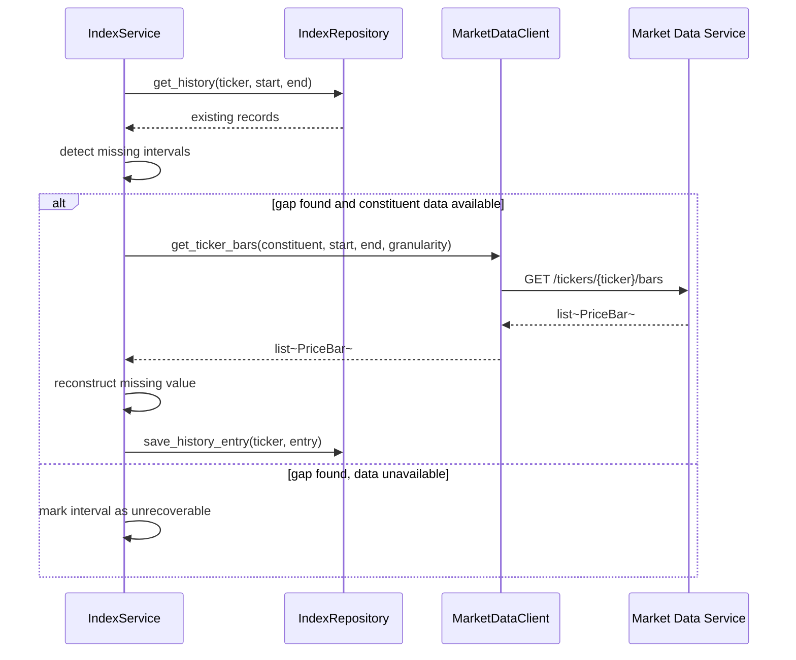
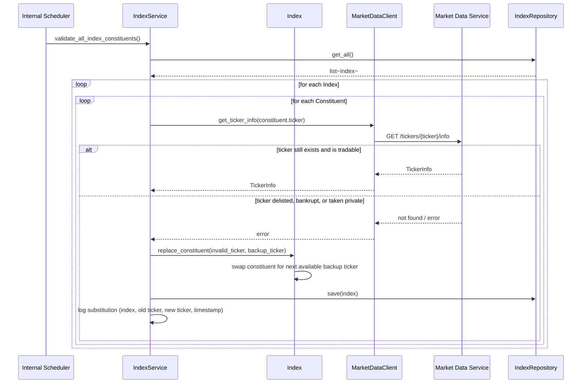

# Index Service Design

**Author:** Dylan Liesenfelt

**Date:** August 21, 2026

---

## 1. Purpose / Scope

The Index Service is the source of truth for custom stock indexes. It maintains index definitions and constituents, calculates current index values, maintains historical values at a minimum 15-minute granularity, detects gaps in historical data, attempts to reconstruct missing values when sufficient constituent market data is available, and validates constituent tickers before each trading day's market open.

The Index Service does not fetch data directly from external providers. It obtains constituent market data through the Market Data Service.

## 2. Class Diagram

## 3. Sequence Diagrams

### 3.1 Scheduled Index Update

### 3.2 Gap Detection and Reconstruction

### 3.3 Pre-Market Constituent Validation

## 4. API / Endpoint Definitions

| Method | Endpoint | Description |
|---|---|---|
| GET | /indexes | List all index quotes |
| GET | /indexes/{ticker} | Latest quote for one index |
| GET | /indexes/{ticker}/history?start=&end= | Historical index values |
| GET | /indexes/{ticker}/makeup-history?start=&end= | Historical constituent weights for an index |
| POST | /indexes | Create a new index definition |
| PUT | /indexes/{ticker} | Update index definition or constituents |

## 5. Data Model / Persistence

PostgreSQL (per CON-003), owned exclusively by this service (Indexes DB), accessed from `data/`. Accessed exclusively through the `IndexRepository` interface; `PostgresIndexRepository` is the concrete implementation. `IndexService` depends only on the interface, so it can be unit tested against a fake in-memory repository without a real database (Dependency Inversion).

**indexes**
| Column | Type | Notes |
|---|---|---|
| ticker | text (PK) | |
| name | text | |
| description | text | |
| weighting_type | text | |
| rebalance_interval | text | |
| start_date | timestamptz | |
| start_value | numeric | |
| divisor | numeric | |
| last_rebalance | timestamptz | |
| last_updated | timestamptz | |

**index_constituents**
| Column | Type | Notes |
|---|---|---|
| id | bigint (PK) | |
| index_ticker | text (FK -> indexes.ticker) | |
| constituent_ticker | text | |
| weight | numeric | |
| market_cap | numeric | |
| last_updated | timestamptz | |

**index_history**
| Column | Type | Notes |
|---|---|---|
| id | bigint (PK) | |
| index_ticker | text (FK -> indexes.ticker) | |
| timestamp | timestamptz | |
| value | numeric | |
| | | UNIQUE(index_ticker, timestamp), enforces NFR-006 |

**index_makeup_history**

Tracks how an index's composition changed over time, distinct from `index_history`, which tracks the index's calculated *value* over time. One row per constituent per snapshot.

| Column | Type | Notes |
|---|---|---|
| id | bigint (PK) | |
| index_ticker | text (FK -> indexes.ticker) | |
| timestamp | timestamptz | |
| constituent_ticker | text | |
| weight | numeric | |
| | | UNIQUE(index_ticker, timestamp, constituent_ticker) |

In `data/`, each of these tables maps to its own Pydantic/ORM record class (e.g. `IndexRecord`, `ConstituentRecord`, `IndexHistoryRecord`, `IndexMakeupHistoryRecord`, `IndexBackupTickerRecord`), separate from the `models/` classes above. `PostgresIndexRepository` is responsible for converting between the two, and for validating what comes back from the database before it's handed to `IndexService`.

## 6. Error Handling

- If Market Data Service is unavailable during `update_all_indexes()`, the affected index keeps its last known value and the failure is logged, it does not stop other indexes from updating (NFR-003).
- Reconstruction (FR-016) is attempted only when the underlying constituent bars are available. If they are not, the interval is marked unrecoverable rather than guessed.
- The `UNIQUE(index_ticker, timestamp)` constraint prevents duplicate historical records from a retried or overlapping job run (NFR-006).
- Calls to `MarketDataClient` use bounded timeouts and a bounded retry policy (NFR-002, NFR-020).
- Constituent validation only treats a ticker as invalid on a definitive "not found" response from Market Data Service. A timeout or transient error is treated as "unable to verify" and is retried on the next scheduled run, it does not trigger a substitution (avoids replacing a valid ticker due to a temporary outage).
- If a constituent ticker is invalid and no backup ticker remains for that index (backups exhausted), the constituent is removed and the index's divisor/weights are recalculated without it. This case is logged at a higher severity for manual review, since it means the index is now running under its intended constituent count.
- Every substitution (FR-020) is logged with the index ticker, the old and new constituent tickers, and a timestamp, satisfying NFR-017.
- Errors surfaced by `IndexRepository` (e.g. a database connectivity issue) propagate as a defined `RepositoryError` rather than an unhandled exception, so `IndexService` can log and respond consistently (NFR-005).

## 7. Dependencies

- Market Data Service (via `MarketDataClient`), for constituent quotes, ticker info, and bars
- Indexes DB (PostgreSQL), via `IndexRepository`

## 8. Configuration

- Per-index `rebalance_interval`
- Minimum historical granularity: 15 minutes (CON-004)
- `update_all_indexes()` job interval
- `validate_all_index_constituents()` job schedule (pre-market, once per trading day)
- Retry count/backoff for Market Data Service calls
- `data/` implementations are swappable via dependency injection (a fake in-memory repository for tests, `PostgresIndexRepository` in production)
