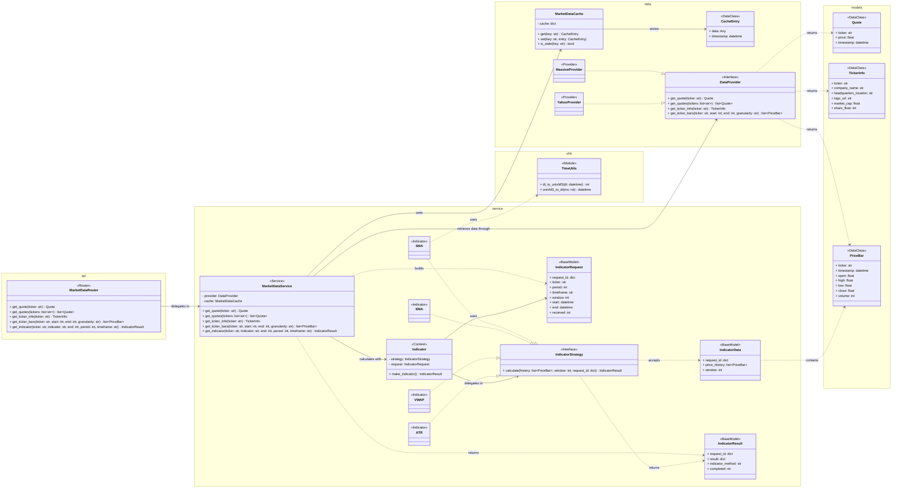
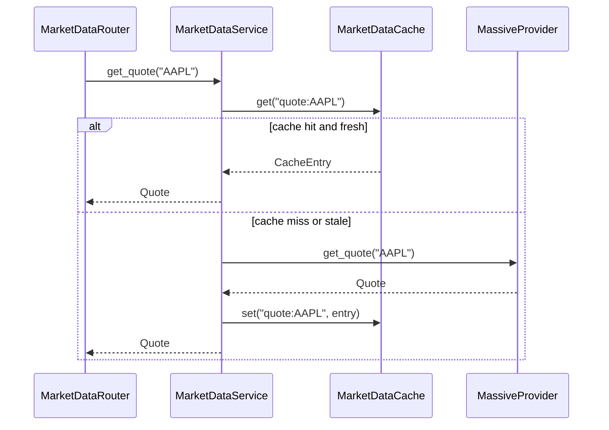
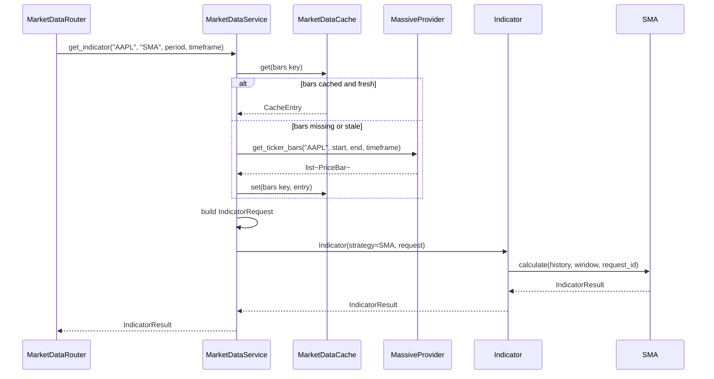

# Market Data Service Design

**Author:** Dylan Liesenfelt

**Date:** August 21, 2026

**Updated:** August 26, 2026

---

## 1. Purpose / Scope

The Market Data Service is responsible for all communication with external financial-data providers. It normalizes provider-specific responses into internal data models, caches recent data to reduce redundant external calls, and calculates technical indicators on demand.

Other internal services obtain market data exclusively through this service, none communicate with Massive.com or any other external provider directly.

## 2. Class Diagram

## 3. Sequence Diagrams

### 3.1 Get Ticker Quote (cache hit/miss)

### 3.2 Calculate Technical Indicator

## 4. API / Endpoint Definitions

| Method | Endpoint | Description |
| --- | --- | --- |
| GET | /quotes/{ticker} | Latest quote for one ticker |
| GET | /quotes?tickers=A,B,C | Latest quotes for multiple tickers |
| GET | /tickers/{ticker}/info | Company info for a ticker |
| GET | /tickers/{ticker}/bars?start=&end=&granularity= | Historical OHLCV bars |
| GET | /tickers/{ticker}/indicators/{indicator}?period=&timeframe= | Calculated indicator values |

## 5. Data Model / Persistence

This service's `data/` layer has no database-backed repository, per ARCHITECTURE.md. Instead `data/` holds `MarketDataCache` (backend TBD, in-memory) and the provider adapters (`MassiveProvider`, `YahooProvider`).

Quotes and bars are not persisted long-term here. Services that need persisted history (e.g. Index Service) store it in their own owned datastore, sourced from this service.

## 6. Error Handling

- All external requests use bounded timeouts (NFR-002), including web-scraping-based lookups (NFR-019).
- Retries against a provider use a bounded retry policy (NFR-020).
- If a provider fails after retries, the service returns a defined application error (e.g. `ProviderUnavailableError`), never an unhandled exception (NFR-021).
- A temporary provider failure does not corrupt cached or internally persisted data (NFR-004).
- Provider-specific response shapes never reach calling services, everything is normalized into `Quote`, `TickerInfo`, `PriceBar`, etc. before returning (NFR-012, NFR-013).
- `MassiveProvider` failure does not crash unrelated internal services (NFR-003). A fallback provider (`YahooProvider`) may be attempted depending on configured provider priority.
- Because `MassiveProvider` and `YahooProvider` both implement `DataProvider`, `MarketDataService` can be unit tested against a fake provider that simulates a failure or slow response, without making a real network call (Liskov Substitution, supports TDD).

## 7. Dependencies

- Massive.com (primary provider, CON-001), via `data/MassiveProvider`
- Yahoo (fallback provider), via `data/YahooProvider`

This service has no dependency on any other internal service, it is a leaf node in the service graph.

## 8. Configuration

- Cache TTL / staleness threshold (used by `is_stale()`)
- Per-provider request timeout
- Retry count/backoff per provider
- Provider fallback order
- Supported indicators and their default parameters
- Supported bar granularities
