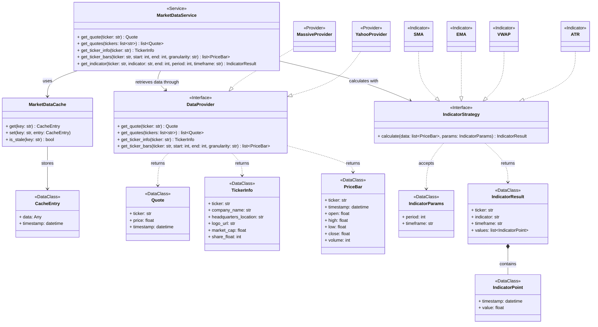

```mermaid
classDiagram
    direction TB

    class MarketDataService {
        <<Service>>
        + get_quote(ticker: str) Quote
        + get_quotes(tickers: list~str~) list~Quote~
        + get_ticker_info(ticker: str) TickerInfo
        + get_ticker_bars(ticker: str, start: int, end: int, granularity: str) list~PriceBar~
        + get_indicator(ticker: str, indicator: str, end: int, period: int, timeframe: str) IndicatorResult
    }


    class MarketDataCache {
        + get(key: str) CacheEntry
        + set(key: str, entry: CacheEntry)
        + is_stale(key: str) bool
    }

    class CacheEntry {
        <<DataClass>>
        + data: Any
        + timestamp: datetime
    }


    class DataProvider {
        <<Interface>>
        + get_quote(ticker: str) Quote
        + get_quotes(tickers: list~str~) list~Quote~
        + get_ticker_info(ticker: str) TickerInfo
        + get_ticker_bars(ticker: str, start: int, end: int, granularity: str) list~PriceBar~
    }

    class MassiveProvider {
        <<Provider>>
    }

    class YahooProvider {
        <<Provider>>
    }


    class IndicatorStrategy {
        <<Interface>>
        + calculate(data: list~PriceBar~, params: IndicatorParams) IndicatorResult
    }

    class SMA {
        <<Indicator>>
    }

    class EMA {
        <<Indicator>>
    }

    class VWAP {
        <<Indicator>>
    }

    class ATR {
        <<Indicator>>
    }


    class Quote {
        <<DataClass>>
        + ticker: str
        + price: float
        + timestamp: datetime
    }

    class TickerInfo {
        <<DataClass>>
        + ticker: str
        + company_name: str
        + headquarters_location: str
        + logo_url: str
        + market_cap: float
        + share_float: int
    }

    class PriceBar {
        <<DataClass>>
        + ticker: str
        + timestamp: datetime
        + open: float
        + high: float
        + low: float
        + close: float
        + volume: int
    }

    class IndicatorParams {
        <<DataClass>>
        + period: int
        + timeframe: str
    }

    class IndicatorResult {
        <<DataClass>>
        + ticker: str
        + indicator: str
        + timeframe: str
        + values: list~IndicatorPoint~
    }

    class IndicatorPoint {
        <<DataClass>>
        + timestamp: datetime
        + value: float
    }


    MarketDataService --> MarketDataCache : uses
    MarketDataService --> DataProvider : retrieves data through
    MarketDataService --> IndicatorStrategy : calculates with

    MarketDataCache --> CacheEntry : stores

    MassiveProvider ..|> DataProvider
    YahooProvider ..|> DataProvider

    SMA ..|> IndicatorStrategy
    EMA ..|> IndicatorStrategy
    VWAP ..|> IndicatorStrategy
    ATR ..|> IndicatorStrategy

    DataProvider ..> Quote : returns
    DataProvider ..> TickerInfo : returns
    DataProvider ..> PriceBar : returns

    IndicatorStrategy ..> IndicatorParams : accepts
    IndicatorStrategy ..> IndicatorResult : returns
    IndicatorResult *-- IndicatorPoint : contains
```
