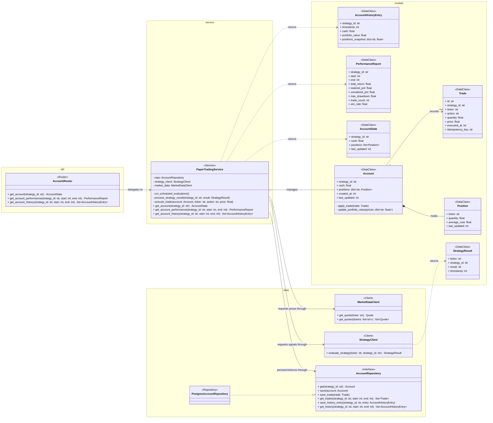
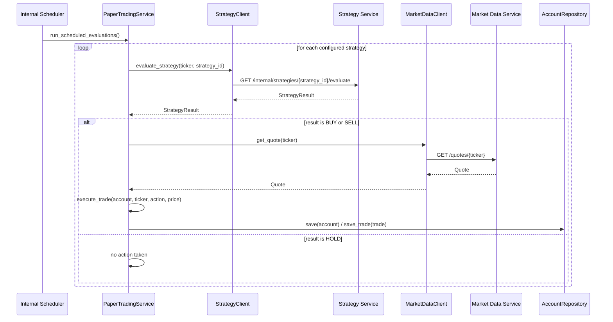
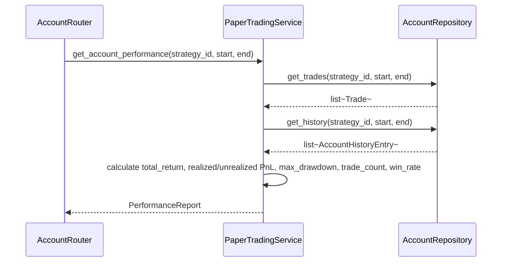

# Paper Trading Service Design

**Author:** Dylan Liesenfelt

**Date:** August 21, 2026

---

## 1. Purpose / Scope

The Paper Trading Service manages persistent simulated trading activity. It maintains one account per configured strategy (FR-021), runs strategy evaluations on a schedule (FR-022), and generates simulated trades when a strategy produces an actionable `BUY` or `SELL` signal (FR-023). It owns all account state, cash, positions, trade history, and portfolio-value history, and calculates performance metrics on request.

This service does not execute real financial transactions and has no connection to any brokerage account, per REQUIREMENTS.md Section 5. It calls the Strategy Service for signals and the Market Data Service for execution prices, it does not contain strategy logic itself.

## 2. Class Diagram

## 3. Sequence Diagrams

### 3.1 Scheduled Strategy Evaluation and Trade Execution

### 3.2 Performance Calculation

## 4. API / Endpoint Definitions

| Method | Endpoint | Description |
|---|---|---|
| GET | /accounts/{strategy_id} | Current account state |
| GET | /accounts/{strategy_id}/performance?start=&end= | Performance metrics over a timeframe |
| GET | /accounts/{strategy_id}/history?start=&end= | Historical account snapshots |

## 5. Data Model / Persistence

PostgreSQL (CON-003), owned exclusively by this service (Paper Trading DB), accessed from `data/`. Accessed exclusively through the `AccountRepository` interface; `PostgresAccountRepository` is the concrete implementation. `PaperTradingService` depends only on the interface, so it can be unit tested against a fake in-memory repository without a real database (Dependency Inversion).

**accounts**
| Column | Type | Notes |
|---|---|---|
| strategy_id | text (PK) | |
| cash | numeric | |
| created_at | timestamptz | |
| last_updated | timestamptz | |

**positions**
| Column | Type | Notes |
|---|---|---|
| id | bigint (PK) | |
| strategy_id | text (FK -> accounts.strategy_id) | |
| ticker | text | |
| quantity | numeric | |
| average_cost | numeric | |
| last_updated | timestamptz | |
| | | UNIQUE(strategy_id, ticker) |

**trades**
| Column | Type | Notes |
|---|---|---|
| id | bigint (PK) | |
| strategy_id | text (FK -> accounts.strategy_id) | |
| ticker | text | |
| action | text | BUY or SELL |
| quantity | numeric | |
| price | numeric | |
| executed_at | timestamptz | |
| idempotency_key | text | derived from (strategy_id, evaluation timestamp, action), UNIQUE, enforces NFR-007 |

**portfolio_history**
| Column | Type | Notes |
|---|---|---|
| id | bigint (PK) | |
| strategy_id | text (FK -> accounts.strategy_id) | |
| timestamp | timestamptz | |
| cash | numeric | |
| portfolio_value | numeric | |
| positions_snapshot | jsonb | |
| | | UNIQUE(strategy_id, timestamp) |

In `data/`, each of these tables maps to its own Pydantic/ORM record class (e.g. `AccountRecord`, `PositionRecord`, `TradeRecord`, `PortfolioHistoryRecord`), separate from the `models/` classes above. `PostgresAccountRepository` is responsible for converting between the two, and for validating what comes back from the database before it's handed to `PaperTradingService`.

## 6. Error Handling

- If the Strategy Service call fails for one strategy during a scheduled run, that strategy's evaluation is skipped and logged, the scheduler continues on to the remaining strategies rather than aborting the whole run (NFR-003, NFR-005).
- If Market Data Service is unavailable when fetching an execution price, the trade is not executed on a guessed or stale price, the miss is logged and picked up again on the next scheduled cycle.
- The `idempotency_key` uniqueness constraint on `trades` prevents a retried or overlapping scheduler run from creating two trades for the same signal (NFR-007).
- A failure inside this service never touches data owned by Strategy Service or Index Service, only its own Paper Trading DB, accessed via `AccountRepository` (NFR-005).
- Errors surfaced by `AccountRepository` propagate as a defined `RepositoryError` rather than an unhandled exception.

## 7. Dependencies

- Strategy Service (via `StrategyClient`), for BUY/HOLD/SELL signals
- Market Data Service (via `MarketDataClient`), for execution prices and portfolio valuation
- Paper Trading DB (PostgreSQL), via `AccountRepository`

## 8. Configuration

- Per-strategy execution schedule (FR-022)
- Starting cash balance for newly configured accounts
- Trade sizing rule (fixed amount vs. percentage of available cash, TBD, worth deciding explicitly)
- Timeout/retry settings for `StrategyClient` and `MarketDataClient` calls
- `data/` implementations are swappable via dependency injection (a fake in-memory repository for tests, `PostgresAccountRepository` in production)
