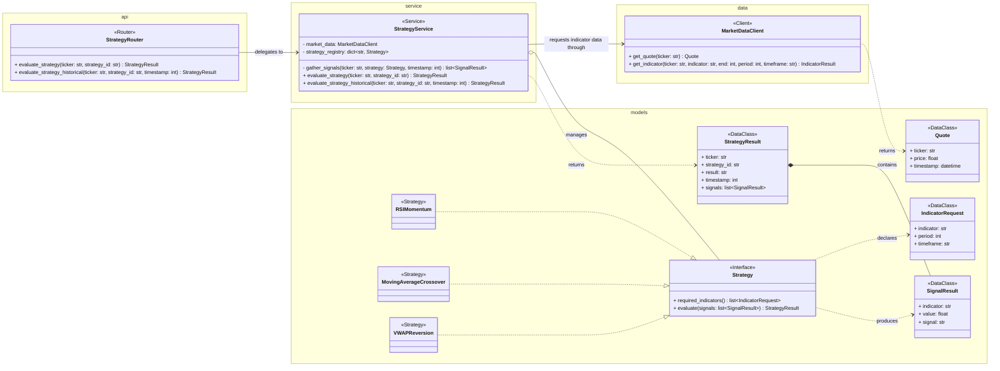
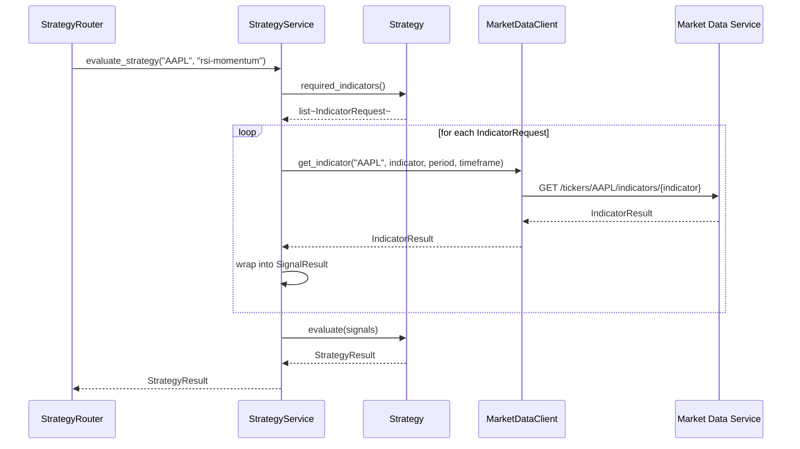
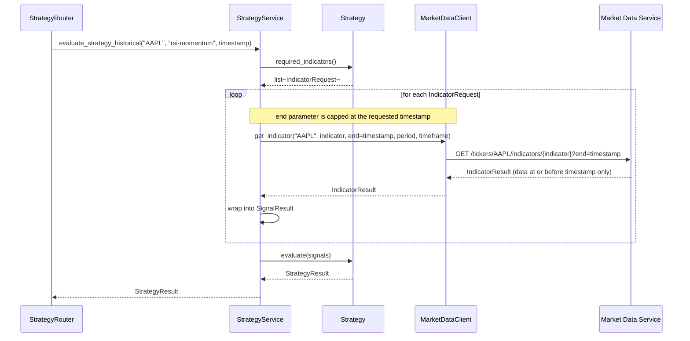

# Strategy Service Design

**Author:** Dylan Liesenfelt

**Date:** August 21, 2026

---

## 1. Purpose / Scope

The Strategy Service contains all trading-strategy business logic. It evaluates a supported strategy for a ticker using either the latest market data or a historical point in time, and returns a `BUY`, `HOLD`, or `SELL` result along with the individual signal results that produced it.

The Strategy Service is stateless with respect to paper-trading account balances and positions (NFR-015). It does not know about accounts, cash, or trades, that is the Paper Trading Service's responsibility. Indicators (SMA, EMA, VWAP, ATR, etc.) are implemented independently in the Market Data Service so they can be reused across multiple strategies (NFR-014), the Strategy Service only combines indicator results into a final signal according to each strategy's own rules.

## 2. Class Diagram

## 3. Sequence Diagrams

### 3.1 On-Demand Strategy Evaluation

### 3.2 Historical Strategy Evaluation

## 4. API / Endpoint Definitions

| Method | Endpoint | Description |
|---|---|---|
| GET | /strategies | List supported strategies (not yet exposed via Gateway, optional addition) |
| GET | /strategies/{strategy_id}/evaluate?ticker= | Evaluate a strategy on demand |
| GET | /strategies/{strategy_id}/evaluate/historical?ticker=&timestamp= | Evaluate a strategy at a historical timestamp |

## 5. Data Model / Persistence

This service's `data/` layer has no database-backed repository, per ARCHITECTURE.md. Supported strategies and their parameters (indicator periods, thresholds, etc.) are configuration, not persisted application data, and the service is stateless between requests.

## 6. Error Handling

- Requested `strategy_id` and `ticker` are validated before evaluation begins (NFR-009). An unknown `strategy_id` returns a `404`, not a silent fallback to a default strategy.
- Historical evaluations only ever request data at or before the given timestamp (FR-010), enforced by passing the timestamp as the `end` bound on every `MarketDataClient` call, never fetched separately and filtered after the fact.
- Calls to `MarketDataClient` use bounded timeouts and a bounded retry policy (NFR-002, NFR-020).
- If Market Data Service is unavailable partway through gathering signals, the evaluation fails outright with a defined error rather than returning a result computed from partial signals, a partial signal set could silently misrepresent the strategy's real recommendation.
- Failure of Market Data Service does not affect unrelated services (NFR-003).
- Each `Strategy` implementation can be unit tested by constructing `SignalResult` inputs directly and asserting on the returned `StrategyResult`, no `MarketDataClient` or network access required (Liskov Substitution across strategies, supports TDD).

## 7. Dependencies

- Market Data Service (via `MarketDataClient`), for quotes and indicator values

The Strategy Service has no dependency on Index Service or Paper Trading Service.

## 8. Configuration

- Registered strategies and their parameters (e.g. RSI period/thresholds, moving-average windows)
- Per-request timeout for Market Data Service calls
- Retry count/backoff for Market Data Service calls
